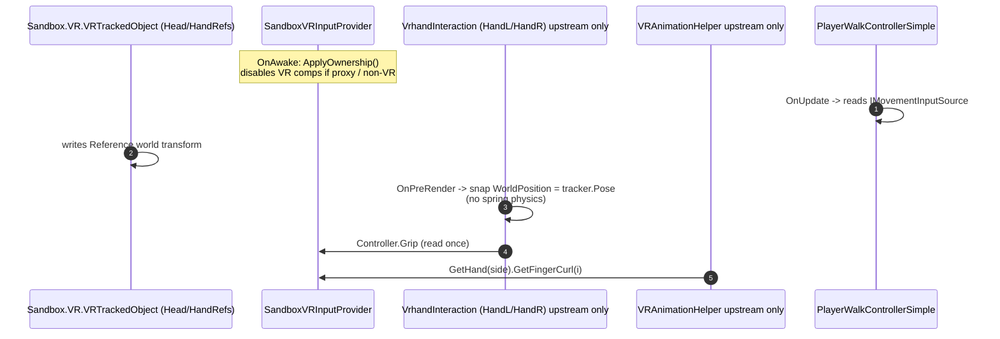

# VR Full-Body Interface-based DI Architecture

> **sbox-scenestaging 讀者注意（2026-05-12）**  
> 本檔為上游 **SBox-VR-Controller** 技術說明之複本；**可編譯實作**已收斂至本倉庫  
> `Libraries/tft.vr.movement/Code/Player/Abstractions/` 與  
> `Libraries/tft.vr.movement/Code/Player/Services/`（下表「本倉庫已併入」）。  
> 表列之 `SandboxVRHandTracker`、`OfficialHandToggle`、`VRHolsterSlot` 等仍屬上游擴充，**本函式庫尚未移植**；互動主軸見 `Code/test/VR/VRGrabber.cs` 與  
> `docs/specs/2026-05-05-vr-interaction-stack.md`。  
> 總覽 spec：`docs/specs/vr-input-di-port.md`。

This project drives all VR/movement input through a small set of interfaces so
that consumers (hand-tracking, animation, weapons, locomotion) never touch
`Sandbox.Input.VR` directly. The result is:

- One place to disable VR for proxy players or non-VR runtimes.
- One place to swap the controller backend (e.g. record/playback for tests).
- Zero per-frame allocations on the VR-input path.
- A clean keyboard fallback so the project is playable without a headset.

> 相關後續遷移文件：
> - [`VR_OFFICIAL_API_INTEGRATION.md`](VR_OFFICIAL_API_INTEGRATION.md)
>   `2026-05-08` 把 input / haptic / hand-tracking / holster 對齊 `Sandbox.VR.*`
>   與 `Sandbox.FixedJoint`。
> - [`VR_OFFICIAL_IK_MIGRATION.md`](VR_OFFICIAL_IK_MIGRATION.md)
>   `2026-05-09` 把手臂 IK 從 EasyIK 改成 `SkinnedModelRenderer.SetIk`，
>   與腳部一致。
> - [`MODEL_AUTHORING_GUIDE.md`](MODEL_AUTHORING_GUIDE.md)
>   外來模型 / FBX 的交付與設定建議。

## Layers

```
                 +------------------------------------------+
   Abstractions  | Libraries/tft.vr.movement/.../Abstractions/ |   pure interfaces & enums
                 +--------------------+---------------------+
                                      |
                                      v
                 +------------------------------------------+
     Services    | Libraries/tft.vr.movement/.../Services/   |   Component impls (subset)
                 +--------------------+---------------------+
                                      |
                                      v
                 +------------------------------------------+
    Consumers    | PlayerWalkController*, optional future    |   resolve via OnAwake
                 | VR-aware components                       |
                 +------------------------------------------+
```

## Abstractions

| Interface | File (sbox-scenestaging) | Purpose |
| --- | --- | --- |
| `IVRInputProvider` | [`IVRInputProvider.cs`](../../../Libraries/tft.vr.movement/Code/Player/Abstractions/IVRInputProvider.cs) | Per-player VR root. Exposes `IsAvailable` + `LeftHand`/`RightHand`. |
| `IControllerInput` | [`IControllerInput.cs`](../../../Libraries/tft.vr.movement/Code/Player/Abstractions/IControllerInput.cs) | Single-controller snapshot (buttons, sticks, fingers, **`AimPose`**, **`IsHandTracking`**, **`*Delta`**, **`*Active`**, **`HapticEffect`-based haptics**). |
| `IHandTracker` | [`IHandTracker.cs`](../../../Libraries/tft.vr.movement/Code/Player/Abstractions/IHandTracker.cs) | World pose of a tracked hand reference GameObject. |
| `IHandSkeletonProvider` | [`IHandSkeletonProvider.cs`](../../../Libraries/tft.vr.movement/Code/Player/Abstractions/IHandSkeletonProvider.cs) | Contract for cached `Sandbox.VR.VRHandJointData` lists (controller / hand motion ranges) for skeletal-mode finger animation. |
| `IMovementInputSource` | [`IMovementInputSource.cs`](../../../Libraries/tft.vr.movement/Code/Player/Abstractions/IMovementInputSource.cs) | Locomotion intent: `WishMove` / `WantsJump` / `WantsCrouch` / `WantsSlowWalk`. |
| `HandSide` enum | [`HandSide.cs`](../../../Libraries/tft.vr.movement/Code/Player/Abstractions/HandSide.cs) | New canonical Left/Right enum. |
| `VRFingerKind` enum | [`IControllerInput.cs`](../../../Libraries/tft.vr.movement/Code/Player/Abstractions/IControllerInput.cs) | Mirror of `Sandbox.VR.FingerValue` (curl 0..4 / splay 10..13). Avoids forcing consumers to take a direct dependency on `Sandbox.VR`. |
| `IRigRebinder` | [`IRigRebinder.cs`](../../../Libraries/tft.vr.movement/Code/Player/Abstractions/IRigRebinder.cs) | Optional rig rebind hook (ported interface; default upstream impl not in tft yet). |

## Service implementations

Namespace **`TFT.VR.Services`**, folder  
[`Libraries/tft.vr.movement/Code/Player/Services/`](../../../Libraries/tft.vr.movement/Code/Player/Services/).

### 本倉庫已併入（可於 `dotnet build tft.vr.movement` 驗證）

| Type | Implements | Notes |
| --- | --- | --- |
| `SandboxVRInputProvider` | `IVRInputProvider` | One per player root. Owns the `VRAnchor` reference and the 3 `VRTrackedObject` components, disabling them on proxies / outside VR. |
| `VRControllerAdapter` | `IControllerInput` (internal) | Pass-through wrapper over `Sandbox.VR.VRController`. Forwards `AnalogInput.Value/.Delta/.Active`, `DigitalInput.IsPressed/.WasPressed/.Active`, `AimTransform`, `IsHandTracked`, `GetFingerSplay/Value`, and `TriggerHaptics` directly. |
| `NullController` | `IControllerInput` | Returned by the provider whenever `IsAvailable` is `false`. Eliminates null checks. Public so unit tests can pin defaults. |
| `VRMovementInputSource` | `IMovementInputSource` | Translates `IControllerInput` (left stick / right A / right B / left stick press) into movement intent. |
| `KeyboardMovementInputSource` | `IMovementInputSource` | Reads `Input.AnalogMove`, `Input.Pressed("Jump")`, etc. for non-VR play. |
| `CompositeMovementInputSource` | `IMovementInputSource` | Picks VR vs. keyboard at runtime via `Game.IsRunningInVR`. |

### 仍在上游 SBox-VR-Controller（本函式庫未移植）

| Type | Notes |
| --- | --- |
| `SandboxVRHandTracker` | `IHandTracker` on `HandLRef` / `HandRRef`. |
| `SandboxVRHandSkeletonProvider` | `IHandSkeletonProvider` cache for `GetJoints`. |
| `OfficialHandToggle` | Toggles official `Sandbox.VR.VRHand` visibility. |
| `VRHolsterSlot` | Holster attachment + `Sandbox.FixedJoint`. |

## Resolution rule

Every consumer follows the same idiom in `OnAwake` (or `OnStart` if it depends
on a fully-initialized child hierarchy):

```csharp
private IVRInputProvider _input;

protected override void OnAwake()
{
    _input = Components.Get<IVRInputProvider>( FindMode.EverythingInSelfAndAncestors );
}
```

**上游專案**：武器／手持物可經 `VrhandInteraction` + `GrabPoint` 取單手控制器。

**sbox-scenestaging**：互動主軸為 `VRGrabber`；手持物若要讀抽象輸入，應解析玩家階層上的 `IVRInputProvider` 或後續適配層（見 `docs/specs/vr-item-weapon-production-workflow.md`）。

## Per-frame behavior



> 上圖描述 **上游** `VrhandInteraction` 管線。sbox-scenestaging 目前以 **`VRGrabber`** 處理抓取，未內建圖中 Hand／Anim 元件；DI 層仍可供 `PlayerWalkController*` 與未來武器適配使用。

Key design decisions:

1. **`VrhandInteraction` runs in `OnPreRender`** so it reads the current frame's
   tracker pose, not the previous one. This is what fixed Quest 3 hand
   tracking.
2. **Hand body is kinematic** (`Body.MotionEnabled = false`). The previous
   spring-joint chain (`PhysicsSpring(150, 5)`) was the lag source.
3. **Provider returns `NullController`** instead of `null` when VR is
   unavailable, so consumers can keep their straight-line code.
4. **Movement is split**: keyboard source works without an HMD, and the
   composite source picks the right one each frame.

## Adding a new VR-aware component (SOP)

1. Add `using TFT.VR.Abstractions;`.
2. Declare a private field for the dependency you need:
   - All-controller access -> `IVRInputProvider`
   - Single hand on a held item ->（上游）`VrhandInteraction.Controller` via `GrabPoint`；（本倉庫）預留經 `IVRInputProvider` 或日後 `IControllerInput` 適配
   - Hand pose -> `IHandTracker`
   - Locomotion -> `IMovementInputSource`
3. Resolve in `OnAwake` via
   `Components.Get<T>( FindMode.EverythingInSelfAndAncestors )`.
4. Guard with `if ( _input is null || !_input.IsAvailable ) return;` (or
   equivalent for movement / tracker).
5. Read state through the interface only - never call `Input.VR.X`.

## Updating Player.prefab

**上游 SBox-VR-Controller**：DI 服務可烘焙進 `Assets/prefabs/Player.prefab`，含 `SandboxVRHandTracker` 等。

**sbox-scenestaging**：請在實際玩家 prefab 根上掛載（視需求）`SandboxVRInputProvider`、`VRMovementInputSource`、`KeyboardMovementInputSource`、`CompositeMovementInputSource`，並與 `PlayerWalkController*` 或既有 `VRPlayerController` **擇一**啟用（見 `docs/specs/vr-locomotion-xmovement.md`）。本倉庫測試場未必包含完整 prefab 烘焙；以場景驗收為準。
