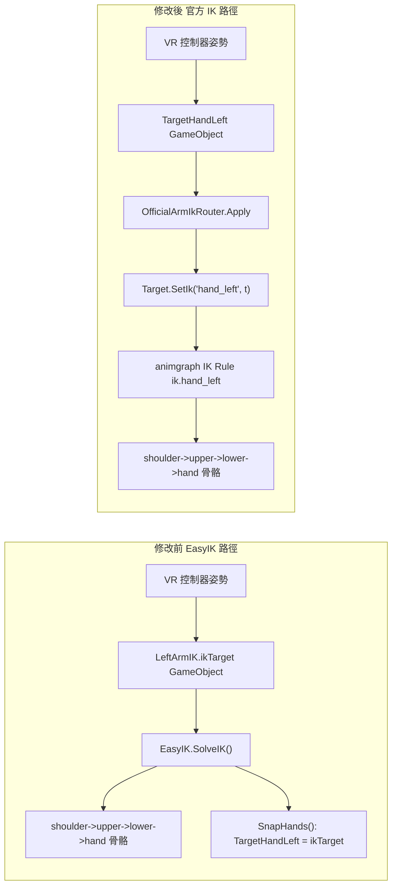

# VR 官方 IK 遷移（EasyIK → SkinnedModelRenderer.SetIk）

> **sbox-scenestaging（2026-05-12）**  
> 本檔記錄上游專案之 EasyIK → `SetIk` 遷移。表列之 `OfficialArmIkRouter`、`VRAnimationHelper` 等**不在**本倉庫；本倉庫全身 IK 目標主軸為 `Code/VRLogic/VRThreePointTracker.cs`，見 `docs/specs/vr-three-point-tracker-architecture.md` 與 `docs/specs/vr-animgraph-contract.md`。

本文件記錄 `2026-05-09` 起把手臂 IK 從自寫的 EasyIK 解算器改用官方
`SkinnedModelRenderer.SetIk("hand_left"/"hand_right", ...)` API 的過程。腳部
IK 早就走官方路徑（`foot_left` / `foot_right`），這次只是把手臂對齊。

> **目前進度**：第一階段（toggle 並行）與第二階段程式清理（移除 EasyIK 類別、刪掉
> `Code/EasyIK/` 資料夾、移除 `LeftArmIK / RightArmIK / SnapHands / AdjustHints / UpdateArms / LeftHint*` 等屬性）皆已完成。
> **唯一還剩的動作**：在 s&box 編輯器內把 `Assets/prefabs/Player.prefab` 上殘存的
> 14 處 EasyIK 參考清掉（步驟見下方 §「Player.prefab 手動清理」）。這必須在
> 編輯器內進行，避免直接改 JSON 造成 GUID 損壞。

## 中文速查（zh-TW）

| 項目 | 重點 |
| --- | --- |
| 開關欄位 | `VRAnimationHelper.UseOfficialIK`（預設 `false`，第一階段先用 EasyIK） |
| 開啟後行為 | 由上游 `OfficialArmIkRouter` 把 `TargetHandLeft/Right.WorldTransform` 推到 animgraph 的 `ik.hand_left` / `ik.hand_right`，沒追蹤就 `ClearIk` |
| 不需要的事 | 不必動 `Assets/citizen_human.vanmgrph`、`Assets/VRCitizen.vmdl`、Player.prefab（第一階段） |
| 第二階段 | 確認手感後再把 `LeftArmIK / RightArmIK / LeftHint / RightHint / SnapHands / AdjustHints / UpdateArms` 全部移除，並刪除 `Code/EasyIK/` |

## 為什麼要切換

1. **與動畫狀態一起被解算**：官方 IK 是 animgraph 在動畫評估流程內解，會跟
   `b_grounded`、`holdtype`、上半身 layer 等動畫一起合成；EasyIK 是 IK Rule
   執行完之後再「強壓」骨頭，會打架。
2. **腳已經是官方 IK，手不一致**：`OnUpdate` 內已經有 `Target.SetIk("foot_left", ...)`
   / `Target.SetIk("foot_right", ...)`。手臂走自寫解算器只是技術債。
3. **減少自寫程式**：一旦切到官方 IK，整個 `Code/EasyIK/` 可以移除，未來換
   外來模型也只需要 animgraph 帶 `ik.hand_left/right` IK Rule（Citizen base
   model 出廠就有）。

## 架構差異



## 關鍵程式碼

| 檔案 | 內容 |
| --- | --- |
| 上游 `Code/VRLogic/OfficialArmIkRouter.cs` | 純路由邏輯 + `IIkParameterSink` 抽象，方便測試 |
| 上游 `Code/Player/VRAnimationHelper.cs` | `UseOfficialIK` 屬性、`ApplyOfficialArmIk()`、`SkinnedModelIkSink` 適配器 |
| 上游 `Code/unittest/VRLogic/OfficialIkArmsTests.cs` | 5 個 fact，覆蓋雙手 active / 一手 active / 雙手 inactive / null sink / key 名稱 |

`VRAnimationHelper.OnUpdate` 內的對應段落：

```csharp
if ( UseOfficialIK )
{
    ApplyOfficialArmIk();
}
else
{
    AdjustHints();
    LeftArmIK.SolveIK();
    RightArmIK.SolveIK();
    SnapHands();
}

lastLeftHandPos = TargetHandLeft.IsValid() ? TargetHandLeft.WorldPosition : lastLeftHandPos;
lastRightHandPos = TargetHandRight.IsValid() ? TargetHandRight.WorldPosition : lastRightHandPos;
```

`MoveShoulders()` 不再讀 `LeftArmIK.ikTarget` / `LeftArmIK.jointChainLength`；
改成讀 `TargetHandLeft.WorldPosition` 與 `ResolveChainLength(handIndex)`，
後者在 EasyIK 模式下仍然回傳 `ik.jointChainLength`，在官方 IK 模式回傳
`ArmLength`（新加的 `[Property]`，預設 30 inches）。

## 切換用法

第一階段預設仍用 EasyIK，需要在 VR 內做 A/B 比較時：

1. 開啟 s&box 編輯器，找 `Assets/prefabs/Player.prefab`。
2. 選到掛 `VRAnimationHelper` 的 GameObject（一般是 player root 下方）。
3. 在 Inspector → Feature `IK` → Category `Arms`，把 `Use Official IK` 勾起來。
4. 進場景跑 VR；想切回 EasyIK 即時取消勾選即可。

> 預設保持 `false` 是為了避免「程式合進來就改變預設行為」，給你機會在
> 實機戴上頭顯後逐項驗證。確認 OK 之後再進入第二階段。

## 第一階段驗證清單（戴頭顯實測）

把 `UseOfficialIK = false` 跑一輪、再切成 `true` 跑一輪，比較下列項目：

- [ ] **單手伸展**：把右手舉過頭、伸到背後、向側貼地。觀察手掌是否平順跟著
      控制器，肘部沒有翻轉。
- [ ] **雙手持槍**：拿起步槍類武器（例如 M4A1）。`AttachmentFirstGrabPoseResolver`
      把左手鎖到前握把，左手應穩定貼在 attachment 點，沒有彈跳。
- [ ] **後座力**：連續發射 → 確認 `Recoiler.WeakenTo` 期間的「短暫鬆手」感覺
      沒被官方 IK 蓋過。
- [ ] **掛回 / 抽出 holster**：對 `VRHolsterSlot`（背後步槍、腰側手槍）做拔
      與掛動作，確認姿態回到位。
- [ ] **物理手 (`UsePhysicalHand = true`)**：切到 heavy 物品（例如球棒），重
      物應該明顯把手往下拉，且鬆手後手立刻回位。
- [ ] **遠距射擊瞄準**：透過 `controller.AimPose.Forward` 抓取流程仍正常觸
      發，沒有因為 IK 改變而抓不到物品。

任一項異常都把 `UseOfficialIK` 切回 `false` 紀錄問題，回頭調 `ArmLength`、
`ShoulderMoveFraction`、`ShoulderLerpPower`。

## 回滾方式

| 想做的事 | 操作 |
| --- | --- |
| 暫時退回 EasyIK | 在 prefab 把 `UseOfficialIK` 取消勾選即可，零程式變動 |
| 完全移除這次變更 | `git revert` 對應 commit；`Code/VRLogic/OfficialArmIkRouter.cs`、`Code/unittest/VRLogic/OfficialIkArmsTests.cs`、本文件會一起被刪掉 |

## 第二階段：乾淨移除 EasyIK（已完成的程式部分）

### 程式（已完成）

- `VRAnimationHelper.cs`：
  - 移除 `UseOfficialIK` 屬性，`ApplyOfficialArmIk()` 直接由 `OnUpdate` 呼叫。
  - 移除 `[Property] EasyIK LeftArmIK / RightArmIK`。
  - 移除 `LeftHint / RightHint / LeftHintAnchor / RightHintAnchor` 屬性與
    `InfluenceVelocity / InfluenceSmoothness / leftHintLerp / rightHintLerp` 欄位。
  - 移除 `SnapHands() / AdjustHints() / UpdateArms()` 方法以及 `updatingArms` 欄位。
  - `RebindRig()` 改成讀 `TargetHandLeft / TargetHandRight` 自己的 transform，
    不再依賴 `LeftArmIK?.ikTarget`。
  - `MoveShoulders.ResolveChainLength` 直接回 `ArmLength`，不再有 EasyIK 分支。
  - `MatchHeight` 不再呼叫 `UpdateArms`，純粹更新 `Height`。
- `VrhandInteraction.cs`：刪除 line 29 未使用的 `[Property] private EasyIK IK`。

### 檔案（已完成）

- 整個 `Code/EasyIK/` 資料夾已刪除（包含 `Assets/Scripts/EasyIK.cs`）。

### Player.prefab 手動清理（**剩餘唯一動作**）

`Assets/prefabs/Player.prefab` 還含 **14 處** 與 EasyIK / Hint 相關的序列化參考。
程式端已不再認得這些欄位，s&box 編輯器載入時會把它們標為 missing component
或 missing reference，**遊戲仍可運行**（手臂走 animgraph IK，腳一樣），但建
議盡早清掉以保持 prefab 乾淨。

> **千萬不要直接編輯 prefab JSON**，避免 GUID 損壞或 component slot 對不上。

打開 s&box 編輯器，依序處理：

1. 選掛 `VRAnimationHelper` 的 GameObject → Inspector：
   - 兩個 missing 欄位 `Left Arm IK` / `Right Arm IK`（component slot）→ 點 `Reset` 或在
     右鍵選單清除。
   - missing GameObject ref：`Left Hint / Left Hint Anchor / Right Hint / Right Hint Anchor` → 同上。
2. Hierarchy 中找到下列 GameObject 並刪除：
   - `LeftHintHandInfluence`
   - `RightHintHandInfluence`
   - 任何 `__type: EasyIK` 的 component holder（約 prefab JSON line 1330 / 1654 對應的
     GameObject；在編輯器內找名為 `LeftArmIK` / `RightArmIK` 的 GameObject 即可）。
3. 兩個 `VrhandInteraction`（`HandLRef`、`HandRRef`）：將它們上面 missing 的
   `IK` 欄位（原本型別 `EasyIK`）清掉。
4. 確認 `TargetHandLeft` / `TargetHandRight` 仍透過 `VrhandInteraction.IKTarget`
   被 Reference path 驅動（不應受影響，但跑一次場景確認無 NRE）。
5. 存檔 → 進場景跑一次驗證雙手 IK 能跟著 VR 控制器。

### 文件（已完成）

- `changlog.md` 已補 `2026-05-09 - Official Arm IK Migration（第二階段）`。
- `docs/VR_DI_ARCHITECTURE.md` 已加上指向本文件的 callout。

## 風險紀錄

| 風險 | 緩解 |
| --- | --- |
| 手部姿勢與 EasyIK 略有差異 | `UseOfficialIK` 開關可即時 A/B；`ArmLength` 屬性可調 |
| 控制器短暫掉追蹤時手 snap 回原位 | `ApplyOfficialArmIk` 已在無 `Active` 時呼叫 `ClearIk(...)` |
| 外來模型沒有 `ik.hand_left/right` IK Rule | 在 [`MODEL_AUTHORING_GUIDE.md`](MODEL_AUTHORING_GUIDE.md) 把 `Base Model = citizen_human_male.vmdl` 列為硬性需求 |
| 手寫 prefab JSON 造成 GUID 損壞 | 第二階段所有 prefab 變更只在 s&box 編輯器內做 |
