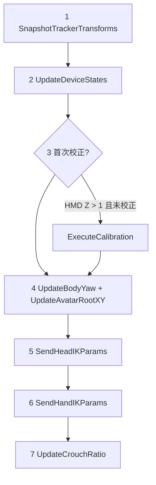

# VRThreePointTracker 架構說明

本文說明 `Code/VRLogic/VRThreePointTracker.cs`（v3）的職責邊界、資料流與模組劃分，方便與 AnimGraph、場景階層對照。

## 定位與設計哲學

`VRThreePointTracker` 是掛在 Avatar 根物件（與 `SkinnedModelRenderer` 同一 GameObject，文中常稱 **Shina**）上的 **Component**。它負責：

- 從場景中的 **Tracker GameObject**（頭部 Camera、左右手）讀取世界座標與旋轉。
- 將 IK 目標與可選的蹲下參數寫入 **AnimGraph**（透過 `SkinnedModelRenderer.Set`）。
- 在 **PlayerController 局部空間** 內調整 Avatar 根的 **Yaw** 與 **XY**，使身體朝向與室內追蹤漂移有合理行為。

刻意 **不做** 的事：

- 不直接改 `WorldPosition`（避免與 `PlayerController` 搶世界位移）。
- 不覆寫骨骼（無 `SetBoneTransform`）；**IK 解算與物理由 S&box AnimGraph C++ 底層處理**。

## 場景與座標約定

| 物件 | 預期角色 |
|------|-----------|
| `HeadTracker` | 帶 `VRTrackedObject`（Head）的 Camera |
| `LeftHandTracker` / `RightHandTracker` | 對應 AnimGraph 左右手鏈的追蹤物件 |
| `AvatarRenderer` | Avatar 的 `SkinnedModelRenderer`，用於 `Set` 參數 |

**座標系**：頭身 Yaw 與 XY 跟隨邏輯假設 `HeadTracker` 與 `AvatarRenderer` 皆為 **PlayerController 子物件**，因此在 **LocalPosition / LocalRotation** 下比較與套用，與控制器根一致。根物件的 **Z 在局部空間固定為 0**；垂直姿態（蹲下）交給 AnimGraph 的 `crouch` 等參數，而非抬降根節點 Z。

## 型別與公開狀態

### 列舉

- **`VRDeviceState`**：`NotConnected` → `Tracking` → `TrackingLost`（由 `ResolveDeviceState` 依上一幀與當前 active 推導）。
- **`VRBodyTurnBehavior`**：身體 Yaw 跟隨頭部的方式——`Instant`、`Smooth`、**`Threshold`**（預設，含磁滯避免邊界抖動）。

### 結構

- **`CalibrationData`**：記錄站立時 HMD 世界高度 `StandingHeadZ`、可選 `AvatarBaseZ`，以及 `IsValid`。預留未來身高比例映射欄位（目前註解占位）。

### 唯讀對外狀態

本幀快照後的頭/手世界位置與旋轉、各裝置 `VRDeviceState`、`CrouchRatio`、`BodyYaw`、`Calibration`。

## 每幀更新管線（OnUpdate）

僅在 `Game.IsRunningInVR` 為真時執行，順序固定如下：

| 步驟 | 說明 |
|------|------|
| 1 | 從三個 Tracker 讀取 `WorldPosition` / `WorldRotation` 到內部欄位，全幀共用同一快照。 |
| 2 | 頭：有 `HeadTracker` 即視為可追蹤；手：需 `Input.VR.LeftHand/RightHand.Active` 且對應 Tracker 存在。 |
| 3 | 首次當 `HeadWorldPos.z > 1` 時自動 `ExecuteCalibration`，之後蹲下計算才有效基準。 |
| 4 | 若 `EnableAvatarRootControl` 且頭部為 `Tracking`：更新身體 Yaw（可選 XY 死區跟隨）。 |
| 5 | 若啟用頭部追蹤且頭部在追蹤：推送頭部 IK 參數（含 `HeadRotationOffset`）。 |
| 6 | 若啟用手部追蹤：僅在 `Tracking` 時更新該手參數；`TrackingLost` 時保留上一幀（手臂凍結）。 |
| 7 | 若啟用蹲下偵測且校正有效：依 HMD 下降量更新 `CrouchRatio`；可選寫入 AnimGraph `crouch`。 |

## 模組對照（與程式註解區塊一致）

| 模組 | 職責 |
|------|------|
| **Module 1** | `SnapshotTrackerTransforms`：Tracker 快照。 |
| **Module 2** | `UpdateDeviceStates` / `ResolveDeviceState`：裝置連線與遺失狀態。 |
| **Module 3A** | `UpdateBodyYaw`：依 `TurnMode` 更新 `_bodyLocalYaw`，寫入 `AvatarRenderer.GameObject.LocalRotation`（僅 Yaw）。 |
| **Module 3B** | `UpdateAvatarRootXY`：`EnableXYFollow` 時在死區外以 `BodyXYFollowSpeed` 拉近 HMD 與 Avatar 根的局部 XY。 |
| **Module 4** | `SendHeadIKParams`：`head_target_pos`、`head_target_rot`（世界空間）。 |
| **Module 5** | `SendHandIKParams` / `SendSingleHandParams`：`hand_l_*` / `hand_r_*` 與左右手旋轉 offset。 |
| **Module 6** | `UpdateCrouchRatio`：依校正基準與 `CrouchRange`、`CrouchTopDeadzone` 計算 0–1 比例；可選 `EnableCrouchAnimation`。 |
| **Module 7** | `ExecuteCalibration`、`Recalibrate`：站立基準與手動重校。 |
| **Module 8** | 註解占位：比例映射、頭部可見性、額外 Tracker、移動參數等擴充點。 |

## AnimGraph 契約（檔頭註解摘要）

C# 推送的參數需與圖中節點對齊，例如：

- **SolveIK chain `head_pos`** ← `head_target_pos`（世界空間向量）。
- **TwoBoneIK `head_rot`** ← `head_target_pos` + `head_target_rot`（世界空間）。
- **TwoBoneIK `VRhandL` / `VRhandR`** ← `hand_l_pos` / `hand_l_rot` 與右手對應欄位。
- **Blend `crouch`** ← `crouch` 浮點 0–1（Phase 2，由 `EnableCrouchAnimation` 控制是否寫入）。

實際節點名稱以專案內 AnimGraph 為準；此表對應原始檔註解中的節點型別與語意。

## Inspector 分組速覽

- **Scene References**：`AvatarRenderer`、`HeadTracker`、左右手 Tracker。
- **Feature Toggles**：頭/手追蹤、Avatar 根控制、蹲下偵測。
- **Head / Hand Settings**：頭與左右手的旋轉補償。
- **Body Turn Settings**：轉身模式、閾值、磁滯釋放角、角速度。
- **Avatar Follow Settings**：XY 死區跟隨開關、半徑、追隨速度。
- **Crouch Settings**：蹲下範圍、頂部死區、是否推送蹲下動畫。
- **Debug**：`ShowDebugGizmos`（世界空間 IK 點與死區球線）。

## 除錯與維運

- **`OnStart`**：`WarnMissingReferences` 對缺引用輸出 `Log.Warning`。
- **`DrawGizmos`**：僅在 `ShowDebugGizmos` 時繪製頭/手目標與 XY 死區；出版前應關閉。
- **`Recalibrate()`**：將 `_autoCalibrated` 清為 false 並重置 `Calibration`，下一幀滿足條件時再次 `ExecuteCalibration`。

## 與 VRGrabber／幽靈手 的階層分工（IK rig 整合）

| 系統 | 職責 |
|------|------|
| **`VRThreePointTracker`** | Avatar 的頭／雙腕 IK **目標**寫入 AnimGraph；可選 Avatar 根局部 Yaw／XY 跟隨 HMD。 |
| **`VRTrackedObject`**（場景） | 官方追蹤鏈：頭部 Camera、左右手追蹤節點；Tracker 引用由本元件 Inspector 指定。 |
| **`VRGrabber`** | 與可抓物之 **物理關節**（`FixedJoint`）、Hover／Grip 閾值、釋放速度；讀手部 `SkinnedModelRenderer` 的 attachment 對齊握姿。 |
| **`VRGhostHandTarget`** | 無剛體之**呈現／輔助對齊目標**（例如副手、瞄準引導）；不建立關節。 |
| **`VRHand`（引擎）** | 手指 curl 等呈現；與本文件 AnimGraph 節點契約並讀；**非** `VRGrabber` 職責。 |

實務上：三點追蹤驅動**身體與手臂 IK**；`VRGrabber` 驅動**手中剛體物**；兩者資料流分離，避免在 C# 重複「手骨架覆寫」與「持物關節」同一套邏輯。AnimGraph 參數與 C++ 邊界見 [vr-animgraph-contract.md](./vr-animgraph-contract.md)。

## 相關程式路徑

- 實作：`Code/VRLogic/VRThreePointTracker.cs`
- 其他 VR 規格可對照：`docs/specs/2026-05-04-vr-player-rig.md`、`docs/specs/2026-05-05-vr-interaction-stack.md`
